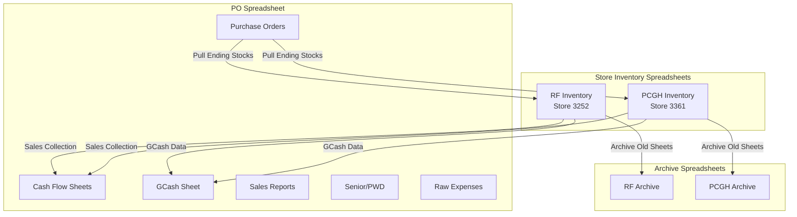
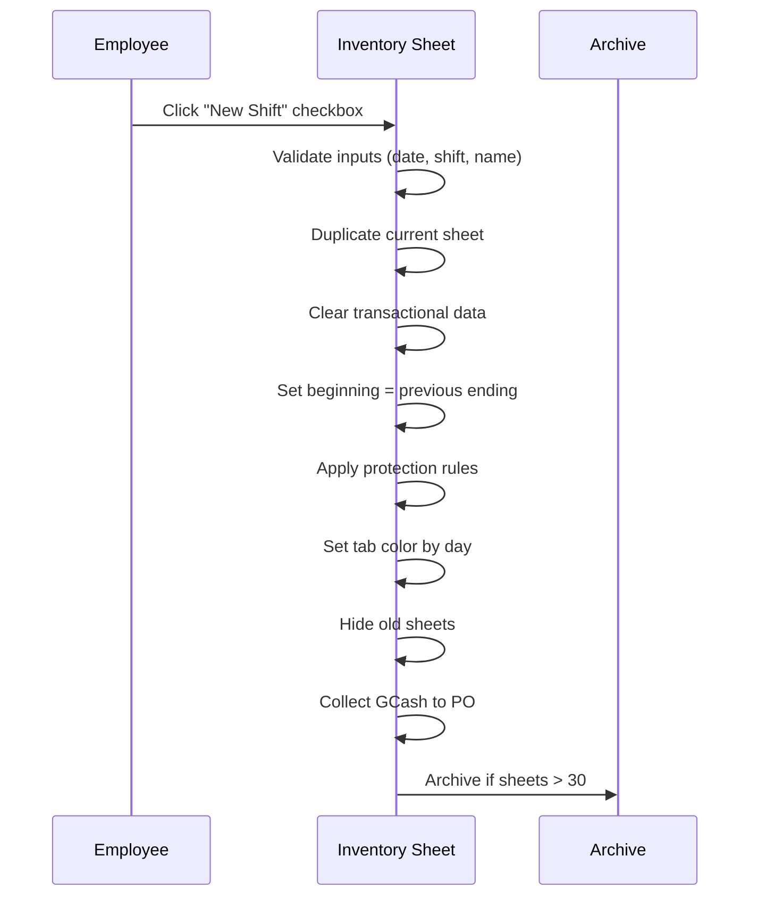
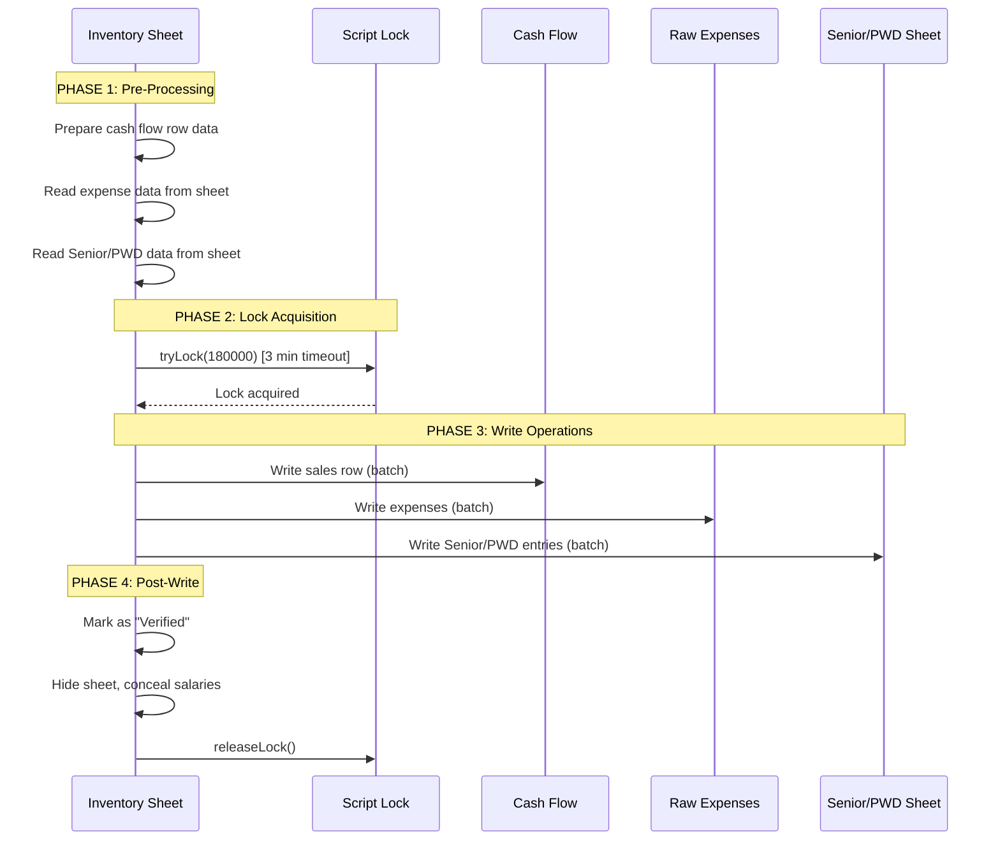
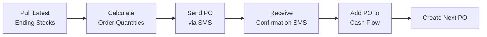

# Mangan Brothers Store Inventory Management System

A Google Apps Script-based inventory and sales tracking system for managing multiple store locations with automated workflows for shift handoffs, sales collection, purchase orders, and cash flow management.

## Table of Contents

1. [Overview](#overview)
2. [Architecture](#architecture)
3. [File Structure](#file-structure)
4. [Store Configuration](#store-configuration)
5. [Main Entry Points](#main-entry-points)
6. [Key Workflows](#key-workflows)
7. [Spreadsheet Integration](#spreadsheet-integration)

---

## Overview

This system manages daily operations for a food/burger business across two store locations. It provides:

- **Shift-based inventory tracking** with automated sheet creation for each shift (AM/Mid/PM)
- **Sales collection** with automatic reporting to a centralized cash flow sheet
- **Purchase Order (PO) management** including SMS integration for orders
- **GCash (mobile payment) tracking** and reconciliation
- **Expense tracking** with categorization
- **Senior/PWD discount tracking**
- **Automated sheet archiving** for completed shifts

---

## Architecture



---

## File Structure

| File | Purpose |
|------|---------|
| [`Code.js`](file:///c:/Users/10017780/appscript/Code.js) | Main entry point for store inventory spreadsheets. Handles shift operations, sales collection, and UI triggers. |
| [`PO.js`](file:///c:/Users/10017780/appscript/PO.js) | Purchase Order spreadsheet logic. Manages PO creation, reports, cash flow, and GCash integration. |
| [`Utils.js`](file:///c:/Users/10017780/appscript/Utils.js) | Shared utility functions used by both spreadsheets (row lookup, alerts, protections, etc.) |
| [`MBInventoryUtils.js`](file:///c:/Users/10017780/appscript/MBInventoryUtils.js) | Inventory-specific utilities (shift creation, sales recording, expense extraction, delivery verification) |
| [`appsscript.json`](file:///c:/Users/10017780/appscript/appsscript.json) | GAS manifest file (timezone: Asia/Taipei, V8 runtime) |

---

## Store Configuration

### Store Identifiers

| Store Name | Store Code | Inventory URL |
|------------|------------|---------------|
| RF | 3252 | `1XxOw-t7q60ULv59GzABMn4uEouFZlZrYtMOMsoLtAtA` |
| PCGH | 3361 | `1rwW-JantrQTuEg2Uzez6XR0xcvceOFbMVuke1t2Idak` |

### Key Spreadsheet URLs

- **PO Spreadsheet**: `10IGAlAy_4LqyFgi3UNAVHBDy9hp69yJOd6oQVhL4JLk`
- **SMS API**: `17yPemlid9FVMdzVDX8Eg8Tu1W-zOg_prNtQeUeEidAg`
- **RF Archive**: `1-31Kf3SsdMhNu1D9ziwBvqlhI6LUTlMgO3PD-vUTNkM`
- **PCGH Archive**: `1QasIoOag67V1I_ePVT_-LaENPTA0Ah1cPI7uo-q7XE`

---

## Environment Configuration

The system now supports multiple environments (PRD, DEV) through a centralized configuration file `Config.js`.

### Configuration File (`Config.js`)

Contains `ENV` object with `PRD` and `DEV` keys. Each environment object holds specific URLs and email addresses.

- **PRD**: Production environment with live URLs and notifications enabled.
- **DEV**: Development environment with testing URLs (some are placeholders) and notifications directed to testing channels if configured.

### Using Configuration

Helper functions in `Config.js` provide easy access to environment-specific values:

- `getConfig(env)`: Returns the full configuration object for the specified environment.
- `getInventoryUrlByConfig(storeCode, env)`: Returns inventory spreadsheet URL.
- `getArchiveUrlByConfig(storeCode, env)`: Returns archive spreadsheet URL.
- `getPoUrlByConfig(env)`: Returns PO spreadsheet URL.
- `getSmsApiUrlByConfig(env)`: Returns SMS API spreadsheet URL.

The `env` parameter defaults to `'PRD'` in all functions, ensuring backward compatibility while allowing explicit environment selection when needed.

---

## Main Entry Points

### Store Inventory Spreadsheet (`Code.js`)

#### `installedOnEditTrigger(e)`

The primary onEdit trigger handler for store inventory sheets. Executes different actions based on which checkbox cell is clicked:

| Cell Location | Action |
|---------------|--------|
| `F{endRow+43}` | **New Shift** - Creates a new shift sheet with date/time/employee name |
| `A{endRow+31}` | **Get Delivery** - Populates delivery quantities from latest PO |
| `A{endRow+33}` | **Hide Old Sheets** - Hides completed shift sheets |
| `A{endRow+35}` | **Show Old Sheets** - Shows last N sheets |
| `A{endRow+38}` | **Hide Verified** - Hides only verified (completed) sheets |
| `A{endRow+40}` | **Show Unverified** - Shows sheets pending verification |
| `A{endRow+43}` | **Unlock Sheet** - Adjusts sheet protection |
| `A{endRow+44}` | **Auto-formula Ending** - Auto-populate ending formulas |
| `M{endRow+9}` | **Collect Sales** - Submits shift sales to centralized cash flow |
| `N{endRow+10}` | **Verify Delivery** - Validates delivery against PO |

#### Supporting Triggers

- `onOpen()` - Registers current sheets to whitelist
- `installedOnChange(e)` - Deletes unauthorized sheet additions

---

### PO Spreadsheet (`PO.js`)

#### `installedOnEdit(e)`

Handles PO spreadsheet interactions:

| Cell | Sheet Context | Action |
|------|---------------|--------|
| `U32` | Any | **Next PO** - Creates new PO sheet for next delivery period |
| `U36` | Any | **Pull Latest Ending** - Fetches current stock levels from inventory |
| `U59` | Any | **Send PO** - Sends PO via SMS API |
| `U75` | Any | **Confirm PO** - Confirms PO receipt via SMS |
| `BE5` | Report sheets | **Generate Report** - Creates order/sales report |
| `O77` | Any | **Add PO to Cash Flow** - Records PO amount |
| `Q1` | Cash flow | **Compute Total Cash** - Calculates cash collected |
| `R1` | Cash flow | **Append to Cash Collected** |
| `S3` | Cash flow | **Add to Cash Received** |
| `S4` | Cash flow | **Record Expenses** |
| `C1/I1` | GCash | **Collect GCash** - Records GCash totals |
| `A1` | RF/PCGH | **Patty Distribution** - Updates patty allocation |
| `A1` | InventoryReplica | **Update Replica** - Syncs inventory across stores |

---

## Key Workflows

### 1. New Shift Creation

Called by clicking the checkbox at `F{endRow+43}` after filling date, shift (AM/Mid/PM), and employee name.



**Day-Color Mapping**:
- Sunday → Red
- Monday → Orange
- Tuesday → Yellow
- Wednesday → Green
- Thursday → Cyan
- Friday → Blue
- Saturday → Magenta

### 2. Sales Collection

Triggered by checkbox at `M{endRow+9}`. Uses `LockService` for concurrency control:



**Key Features:**
- **Pre-processing**: All data collected before lock acquisition to minimize lock hold time
- **3-minute timeout**: Uses `LockService.getScriptLock().tryLock(180000)` 
- **Batch writes**: Multiple rows written in single API calls for efficiency
- **Guaranteed cleanup**: Lock released in `finally` block even if errors occur

### 3. Purchase Order Workflow



### 4. Delivery Verification

Validates that delivered items match PO expectations:

1. Parses inventory sheet name for date
2. Looks up corresponding PO sheet
3. Compares inventory "Delivered" value with PO "Sales equivalent"
4. Shows match/mismatch status

---

## Spreadsheet Integration

### Column Layout (Inventory Sheet)

| Column | Content |
|--------|---------|
| A | Product names |
| B | Beginning inventory (linked to previous ending) |
| C | Delivery |
| D | Ending |
| E | Pull-out |
| F | Order slip |
| G | Tally |
| H | GCash button |
| I | Grab orders |
| J | Price |
| M | Total/Sales values |
| N | Loss/Over |

### Dynamic Row Calculation

The system uses a marker row `<END>` in column A to determine the `endRow` value, allowing the product list to grow without hardcoded row references.

### Sheet Protection

Protected ranges are defined in `getMBUnprotectedRangeList()` to allow employee editing of:
- Delivery/Ending/Pull-out columns
- Order slip and GCash entries
- Notes and expense areas
- New shift input fields

---

## SMS Integration

The system integrates with an external SMS service via a dedicated "SMS" sheet:

```
SMS Sheet Structure:
Column A: Phone number
Column B: Message content  
Column C: Send trigger (checkbox)
```

Used for:
- Sending purchase orders to suppliers
- Confirming received orders
- Error notifications to administrators

---

## Error Handling

- Errors are emailed to `bakulinglings@gmail.com`
- SMS alerts sent to configured phone numbers
- Certain expected errors are ignored:
  - Service access timeouts
  - Duplicate sheet protection errors
  - Document access failures

---

## Notes

- **Timezone**: Asia/Taipei (GMT+8)
- **Runtime**: Google Apps Script V8
- **Multi-store**: Supports RF (3252) and PCGH (3361) stores
- **Archive Policy**: Sheets older than 30 are moved to archive spreadsheets
- **Shift Types**: AM, Mid (Midday), PM

---

## Related Spreadsheets

### Store Inventory (Code.js target)
- [Sample RF Inventory Sheet](https://docs.google.com/spreadsheets/d/1Q2hoJFrAvF3ts20ZCj_d1iiEEopVRwPOggJrb-ByE1I/edit)

### Purchase Orders (PO.js target)  
- [PO Management Sheet](https://docs.google.com/spreadsheets/d/1cFNpUtPZlsgSfeufeNNt5quGvpcrpfUyZzvUhoEMtNg/edit)

---

## Agent Instructions

### Code.js
- [Code.js](Code.js)
- This is the main file that will be run. Entry point is the `installedOnEditTrigger()` function.

### PO.js
- [PO.js](PO.js)
- This is another main file that will be run. Entry point is the `installedOnEditTrigger()` function.
- Do not remove the "Utils" namespace in this file. Assume that "Utils" namespace will contain all other java script files in this project.

### Utils.js
- [Utils.js](Utils.js)